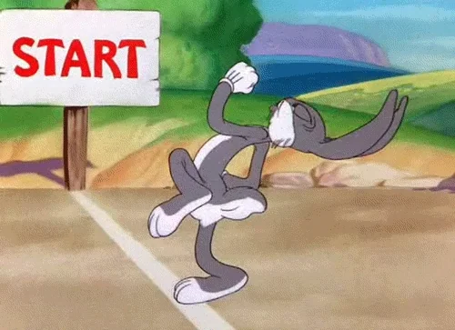

# Basic Coding ✨💖

**Basics are the key!** In this chapter, we’ll focus on the fundamental concepts of programming that you need to know before diving into the exciting world of Data Structures and Algorithms (DSA). 🚀

## What We Will Cover 🎯🎯

* **What is Programming?**: Understanding the basics of how we communicate with computers.

* **Variables**: Learning how to store and manipulate data effectively.

* **Conditional Statements**: Making decisions in our code using if, else if, and else to control the flow.

* **Ternary Operators and Switch Statements**: Writing concise conditions and handling multiple cases with ease!

Let’s unlock the magic of coding together! ✨

